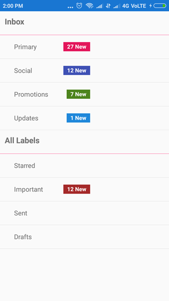

# How-to-integrate-the-badge-SfBadgeView-into-Xamarin.Forms-ListView
This demo explains How to integrate the badge (SfBadgeView) into Xamarin.Forms ListView. [Syncfusion Xamarin.Forms SfBadgeView](https://help.syncfusion.com/xamarin/badge-view/getting-started) can be integrated with the Xamarin.Forms ListView component to indicate new notification with color based on priority.

In the following code, default badges are used with customizing its color, corner radius and its text through [BackgroundColor](https://help.syncfusion.com/xamarin/badge-view/badge-customization#badge-background-customization), [CornerRadius](https://help.syncfusion.com/xamarin/badge-view/badge-customization#setting-corner-radius-of-the-badge) and [BadgeText](https://help.syncfusion.com/xamarin/badge-view/getting-started#adding-badge-text) properties. This replicate the similar UI like Gmail format with the help of ListView template and its group header template.

To avoid rendering problem on its template elements, use the CachingStrategy as RecycleElement in ListView.

[XAML]

```
<ListView ItemsSource="{Binding Items}"
                  SelectionMode="Single" 
                  RowHeight="50"
                  IsGroupingEnabled="True"
                  CachingStrategy="RecycleElement"  
                   >
            <ListView.ItemTemplate>
                <DataTemplate>
                    <ViewCell>
                        <Grid Margin="30,0,0,0">
                            <Grid.ColumnDefinitions>
                                <ColumnDefinition Width="*"/>
                                <ColumnDefinition Width="*"/>
                            </Grid.ColumnDefinitions>
                            <Label HorizontalOptions="Start" VerticalOptions="Center" Text="{Binding Category}"/>
                            <badgeview:SfBadgeView  BadgeText="{Binding Count, Converter={StaticResource ZeroValueConverter}}"  HorizontalOptions="End"  VerticalOptions="Center">
                                <badgeview:SfBadgeView.BadgeSettings>
                                    <badgeview:BadgeSetting BadgeType="None" BackgroundColor="{Binding Color}" TextColor="White" FontAttributes="Bold" CornerRadius="0" BadgePosition="TopRight" />
                                </badgeview:SfBadgeView.BadgeSettings>
                            </badgeview:SfBadgeView>
                        </Grid>
                    </ViewCell>
                </DataTemplate>
            </ListView.ItemTemplate>
            <ListView.GroupHeaderTemplate>
                <DataTemplate>
                    <ViewCell>
                    <Label Margin="10,10,0,0" FontSize="17" FontAttributes="Bold" Text="{Binding Heading}"/>
                    </ViewCell>
                </DataTemplate>
            </ListView.GroupHeaderTemplate>
        </ListView>
```


Please find its corresponding model and view model to populate the required information into listview

[C#]

```
public class Model
    {
        public string Category { get; set; }

        public int Count { get; set; }

        public Color Color { get; set; }
    }

[C#]
public class ViewModel
    {
        public ObservableCollection<ModelList> Items { get; set; }

        public ViewModel()
        {
            var modellList1 = new ModelList()
            {
                new Model(){Category = "Primary", Count = 27, Color = Color.FromHex("#e3165b")},
                new Model(){Category = "Social", Count = 12, Color = Color.FromHex("#3f51b5")},
                new Model(){Category = "Promotions", Count = 7, Color = Color.FromHex("#4d841d")},
                new Model(){Category = "Updates", Count = 1, Color = Color.FromHex("#2088da")},
            };
            modellList1.Heading = "Inbox";

            var modellList2 = new ModelList()
            {
                new Model(){Category = "Starred", Count = 0, Color = Color.Brown},
                new Model(){Category = "Important", Count = 12, Color = Color.Brown},
                new Model(){Category = "Sent", Count = 0, Color = Color.FromHex("#e3165b")},
                new Model(){Category = "Drafts", Count = 0, Color = Color.FromHex("#e3165b")},
            };
            modellList2.Heading = "All Labels";

            Items = new ObservableCollection<ModelList>()
            {
                modellList1,
                modellList2
            };
        }
    }

    public class ModelList:ObservableCollection<Model>
    {
        public ObservableCollection<Model> Models => this;
        public string Heading { get; set; }
    }
    
```

# Output
 



## See also

[How to customize the badge view](https://help.syncfusion.com/xamarin/badge-view/badge-customization)

[How to add the predefined symbols in badge view](https://help.syncfusion.com/xamarin/badge-view/predefined-symbols)

[How to animate badge view](https://help.syncfusion.com/xamarin/badge-view/animation)

[How to change the position of badge](https://help.syncfusion.com/xamarin/badge-view/position-customization)


